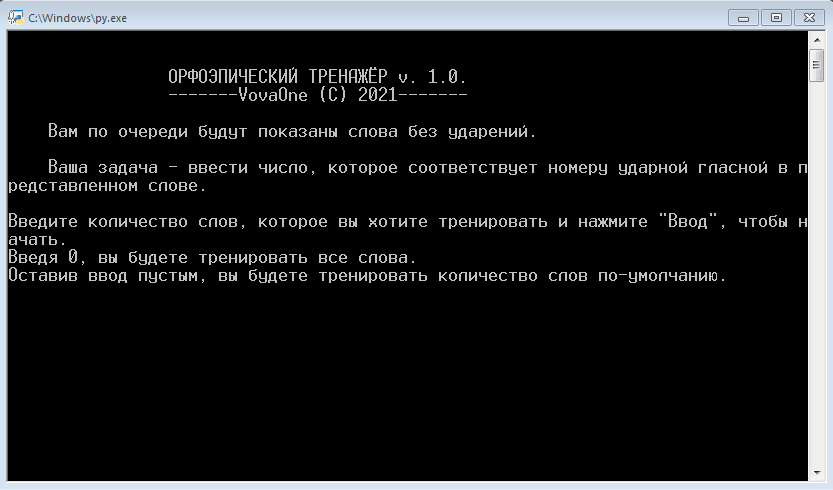

# Орфоэпический тренажёр
#### v. 1. 0. 1. |  Сделал Vladimir T. (VovaOne) © 2021

## Новое в версии 1. 0. 1.
- Рефакторинг кода

## Описание
Приложение позволяет тренировать постановку ударения в словах.

## Особенности
- Бесплатно!
- Возможность добавления своих слов для тренировки.
- Можно выбрать, какое количество слов вы будете тренировать за сеанс.
- Возможность повторения тех слов, в которых вы допустили ошибку.
- Приложен файл с более чем 300 словами, взятых из орфоэпического словаря ФИПИ.
(https://fipi.ru/navigator-podgotovki/navigator-ege#ru)
- Допустимо модифицировать код для собственного удобства при знании Python.

## Добавление своих слов
1. Откройте words.txt
2. Оформите текстовый документ соотвествующим образом - просто соблюдайте следующие правила:
  - Одна строка - одно слово.
  - Ударная(-ые) гласная(-ые) в слове, должны быть заглавными. В слове хотя бы одна буква должна быть заглавное, иначе вы рискуете столкнуться с некорректным "правильным ответом" на вопрос.
  - Не оставляйте в конце файла пустую строку или строки, иначе вы рискуете столкнуться с пустым вопросом в тренажёре.
  - Чтобы добавить пример к слову, заключите пример в круглые скобки.
3. Сохраните и закройте файл.

Так или иначе, предоставляемый изначально файл наглядно показывает вам, как его стоит оформлять.  
**ПРИ СОЗДАНИИ ФАЙЛА ИЛИ ЕГО ИЗМЕНЕНИИ, УБЕДИТЕСЬ, ЧТО КОДИРОВКОЙ ФАЙЛА ЯВЛЯЕТСЯ ANSI.**

## Запланированное
Автор подразумевает, что будет поддерживать разработку проекта. Вот список того, что может быть добавлено в будущем:
- [ ] **Файл с параметрами тренажёра.** Например, количество слов по-умолчанию, необходимое количество повторений для каждого слова во время повторения
- [ ] **Автоматическое форматирование words.txt.** Пользователю придётся меньше заботиться о правильности оформления файла со словами. Например, будут автоматически убираться лишние символы, обнаруживаться и убираться дубликаты, пустые строки и т. д.
- [ ] **Умное предложение слов.** Программа будет чаще предлагать те слова, в которых у пользователя чаще всего возникали ошибки.
- [ ] **Графический интерфейс.** Консольное окно - это временное решение. Хотя нет ничего более постоянного, чем временное.
  - **Таймер, рекорды и прочие мелочи.** Добавление графического интерфейса позволяет открыть возможность для большего количества вещей, которые можно реализовать.

## Для тех, кто разработчик
Мимопроходящий и неравнодушный, конечно, может помочь мне с перечисленным в списке, но в остальном же этот список создан для меня самого.

> *Прежде чем приступать к дальнейшей работе над приложением, настоятельно рекомендуется решить проблемы, указанные в списке ниже.*

- [x] **Оптимизация и улучшение кода, его читабельности.** Думаю, с этим и вправду есть проблемы. Во многих местах алгоритм можно упростить, какие-то части алгоритма можно сделать более производительными. Что можно сказать точно, так это то, что код нужно привести к форме, декларируемой в PEP8. Ещё можно было бы поправить документацию кода и комментарии к нему. Да и вообще, стоит сказать, что приступая к работе, я не занимался проектированием.
- [ ] **Некоторые улучшения в коде.** Например объединение функций, отвечающие за основную тренировку и за повторение, так как они очень сильно похожи друг на друга.
- [ ] **Тестирование работоспособности кода.** Не то, чтобы я не слышал про юнит-тесты, просто они должны быть. Но их нет. А должны...
- [ ] **Слова, в которых более 9 гласных.** Конечно, эта проблема пропадёт сама-собой, если реализовать нормальный графический интерфейс, ну, а пока, с отображением порядкового числа гласных в 10-й и более гласных в слове могут быть проблемы. Хотя я не проверял, но нутром чую.
- [ ] **Проблемы с кодировками.** У меня не было особого желания углубляться в это. Программа не в состоянии читать текстовые файлы в кодировке, отличной от ANSI. Нужно исправить.

### Как начать работу?
Настрока окружения, в общем-то, не требуется, как и установка зависимостей и модулей. Достаточно просто иметь интерпретатор Python 3.8 (3.8.7 в моём случае) и клонированный репозиторий.
