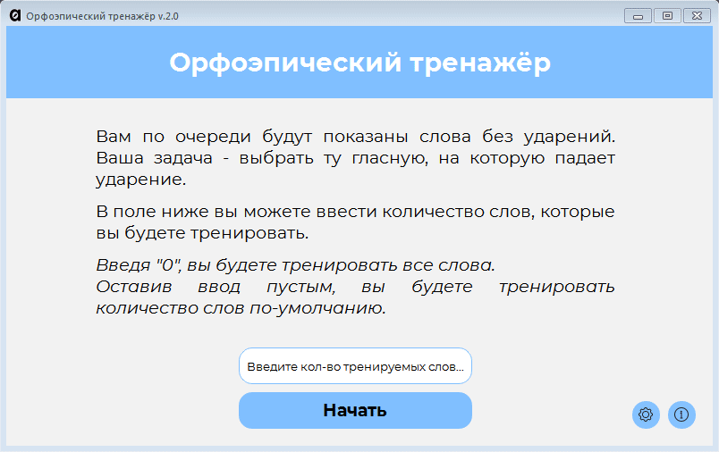

# Орфоэпический тренажёр
#### v. 2.0 (от 02.05.21)  |  Сделал Vladimir T. (VovaOne) © 2021

## Список нововведений
[Посмотреть](https://github.com/VovaOneReal/OrthoepicTrainer/blob/main/CHANGELOG.txt)

## Описание
Приложение позволяет тренировать постановку ударения в словах.

## Системные требования
**OS:** Windows 7/8/10 (x64)  
**Hard Drive:** ~200 MB

## Особенности
- Бесплатно!
- Возможность добавления своих слов для тренировки.
- Можно выбрать, какое количество слов вы будете тренировать за сеанс.
- Возможность повторения тех слов, в которых вы допустили ошибку.
- Приятный и понятный визуальный стиль интерфейса.
- Поддержка слов с несколькими ударениями и поддержка примеров употребления для данного слова.
- Используется более чем 300 слов из орфоэпического словаря ФИПИ.
(https://fipi.ru/navigator-podgotovki/navigator-ege#ru)
- Допустимо модифицировать код для собственного удобства при знании Python.

## Добавление своих слов
1. Откройте words.txt
2. Оформите текстовый документ соответствующим образом — просто соблюдайте следующие правила:
  - Одна строка — одно слово.
  - Ударная(-ые) гласная(-ые) в слове, должны быть заглавными. В слове хотя бы одна буква должна быть заглавное, иначе вы рискуете столкнуться с некорректным "правильным ответом" на вопрос.
  - Не оставляйте в конце файла пустую строку или строки, иначе вы рискуете столкнуться с пустым вопросом в тренажёре.
  - Чтобы добавить пример к слову, заключите пример в круглые скобки.
  - Рекомендуется не оставлять ненужных пробелов после слов.
3. Сохраните и закройте файл.

Так или иначе, предоставляемый изначально файл наглядно показывает вам, как его стоит оформлять.  
**ПРИ СОЗДАНИИ ФАЙЛА ИЛИ ЕГО ИЗМЕНЕНИИ, УБЕДИТЕСЬ, ЧТО КОДИРОВКОЙ ФАЙЛА ЯВЛЯЕТСЯ ANSI.** Откройте файл в стандартном блокноте Windows > "Сохранить как..." с выбранным параметром "Кодировка: ANSI".

## Запланированное
Автор подразумевает, что будет поддерживать разработку проекта. Вот список того, что может быть добавлено в будущем:

### Внешний вид
- [ ] **Адаптивный дизайн.** Чтобы можно было развернуть на весь экран.
- [ ] **Однооконное приложение.** Вся программа будет работать только в одном окне.
- [ ] **Безрамочный стиль.** Отсутствие стандартной рамки окна Windows.
- [ ] **Пользовательские настройки внешнего вида.** Пользователь сможет изменить, например, расстояние между буквами в словах, шрифт, цвет (или выбрать заранее заготовленные темы).
- [ ] **Плавные анимации.**

### Слова для тренировки
- [ ] **Автоматическое форматирование words.txt.** Пользователю придётся меньше заботиться о правильности оформления файла со словами. Например, будут автоматически убираться лишние символы, обнаруживаться и убираться дубликаты, пустые строки и т. д.
- [ ] **Нативное изменение words.txt.** Добавлять, убирать да и вообще изменять слова для тренировки можно будет прямо в приложении вместе с удобными инструментами для редактирования.
- [ ] **Тренировать группы слов.** В words.txt можно сформировать группу слов, а перед началом сессии можно выбрать какие из групп тренировать, а какие нет. Например тренировка только существительных.
- [ ] **Оформление имени собственного.** Если указано имя собственное, то пользователю нужно будет поставить в файле у этого слова пометку, которая даст алгоритму понять, что перед ним имя нарицательное и первая букву в нём не является ударной.
- [ ] **Справочный материал.** Возможность узнать, почему ударение ставиться именно так, а не иначе, если такая справка существует.

### Процесс тренировки
- [ ] **Умное предложение слов.** Программа будет чаще предлагать те слова, в которых у пользователя чаще всего возникали ошибки.
- [ ] **Возможность никогда не тренировать слово.** Можно также получить список отключённых слов и включить их, чтобы меньше взаимодействовать с файлом.
- [ ] **Возможность намеренного добавления слова для повторения** даже если был дан верный ответ.
- [ ] **Сброс прогресса повторения для слова** если была допущена ошибка.
- [ ] **Досрочное завершение сессии.**
- [ ] **Перемешивание повторяемых слов.**

### Интерфейс
- [ ] **Улучшенное взаимодействие с программой.** Можно будет полноценно использовать только клавиатуру. Также при запуске будет автоматически устанавливаться фокус на окно ввода количества слов, а при нажатии на Enter будет начата тренировка и так далее...
- [ ] **Статистика верных/неверных ответов и сколько ещё вопросов осталось.**

### Прочее
- [ ] **Таблица успеваемости.** Сохраняет результат тестирования по *всем словам* из текущего файла (один и тот же файл или нет, проверяется, думаю, по контрольной сумме). Сохраняется именно количество неверных ответов и дата результата. Возможно, потом это можно будет отобразить в виде графика.
- [ ] **Звуки.** Когда ответ верный или неверный. Возможно звук кнопок.
- [ ] **Поддержка английского языка.**

## Для тех, кто разработчик
*Мимопроходящий* и неравнодушный, конечно, может помочь мне с перечисленным в списке, но в остальном же этот список создан для меня самого.

- [ ] **Тестирование работоспособности кода.** Не то, чтобы я не слышал про юнит-тесты, просто они должны быть. Но их нет. А должны...
- [ ] **Большое количество букв в слове.** Следовало бы анализировать количество букв и задавать соответствующие стили элементам интерфейса.
- [ ] **Проблемы с кодировками.** У меня не было особого желания углубляться в это. Программа не в состоянии читать текстовые файлы в кодировке, отличной от ANSI. Нужно исправить.
- [ ] **Debug-режим.** Структура программы усложняется. Будет не лишним со временем добавить возможность выводить лог работы программы, чтобы было проще отлавливать ошибки при использовании программы другими пользователями.
- [ ] **English.** В том числе перевод комментариев на английский, а также перевод интерфейса программы. Да и всего репозитория короче...

### Как начать работу?
1. Установить Python 3.8 (3.8.7 в моём случае).
2. Установить PySide6 6.0 Установка производилась в соответствии с официальной инструкцией - https://doc.qt.io/qtforpython/quickstart.html
3. Клонировать репозиторий.

*Для редактирования .ui, использовать поставляемый вместе с PySide QtDesigner. Для конвертации .ui в .py использовать convert_ui.bat. Для .qrc -> .py использовать convert_res.bat*
